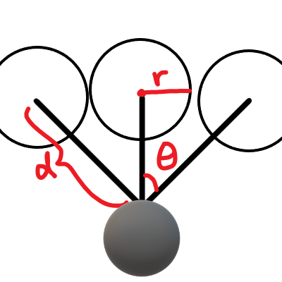

# Slime Mold Simulation
- This Simulation is aimed to replicate the behaviour of the _Physarum polycephalum_ slime molds.


## How it works

- The simulation is composed of two 2D grid of cells. The first layer holds the agents which will represent the slime mold cells *_(Not pictured in the demo)_*. The second layer *_(called the chemical layer)_* holds the "pheromones" that the cells emit as they move around.
- The chemical grid performs 2 operations at the begining of every step of the operation, diffusion and evaporation
  - **Diffusion**: the pheromones spread to neighboring areas
  - **Evaporaiton**: the pheromones in the entire grid decrease by some evaporation factor 
- Every step of the simulation, the agents will decide where to go based off of 3 regions used to estimate the pheromone frequency in the areas. The regions have a radius of $r$ and are located $d$ units away and are spread by angle $\Theta$. When the agent decides which direction they're heading towards, there is a chance that they might over or under steer. This randmoness is used to encourage exploration and discourage too much cohesion.



## Technical Information
  
- Implemented in python using the pygame library.
- The implementation was constructed based off the description of the simulation in this [Sebastian Lague](https://youtu.be/X-iSQQgOd1A?si=TwhPUZRPuoYZKCPp) video.
- The implementation doesn't use any shaders to accelerate computation since Pygame doesn't it.

## Build information

### Requirements

- Python 3

- Pygame graphics library

### Instructions

- Install Pygame using Pip

```shell

python3 -m pip install pygame

```

- Execute program using Python

```shell

python3 ./main.py

```

- Enjoy!

### Controls

- **Space** to pause and unpause the simulation
- **Arrow Up** and **Arrow Down** to respectively increase and decrease the sensing distance $d$
- **W** and **S** to respectively increase and decrease how much the agents oversteer/understeer
- **D** and **A** to respectively increase and decrease the chance of the oversteer/understeer

## Known Bugs

- Clicking inside the window will crash the software but it's a relatively easy to fix by disabling mouse functionality
